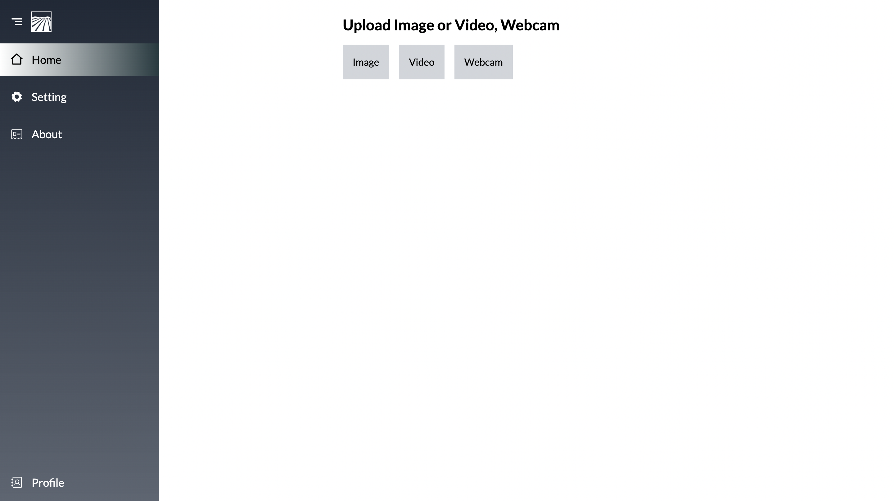
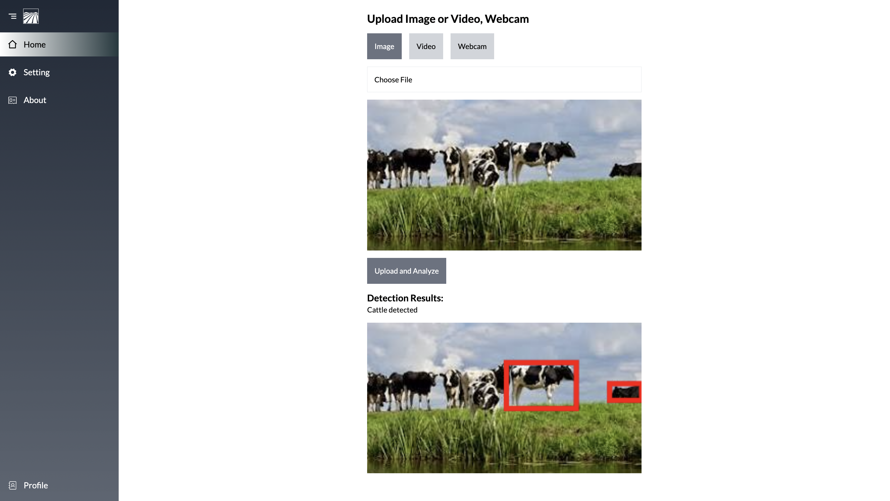
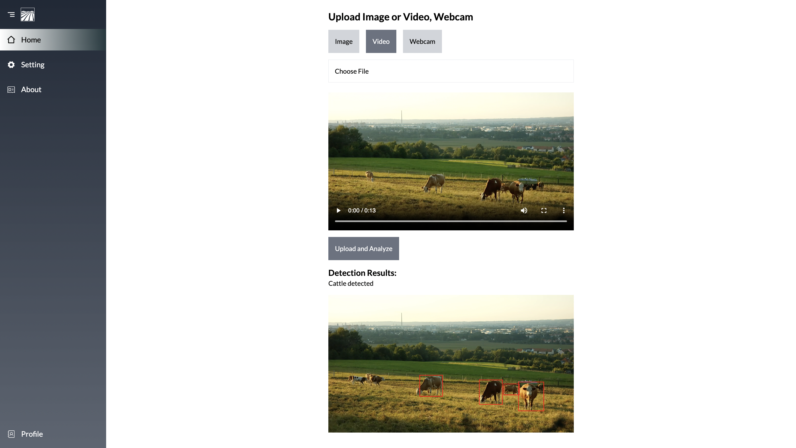
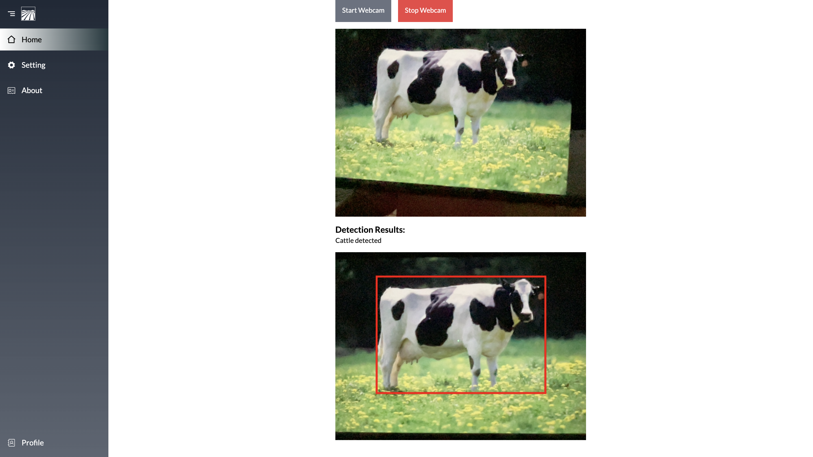
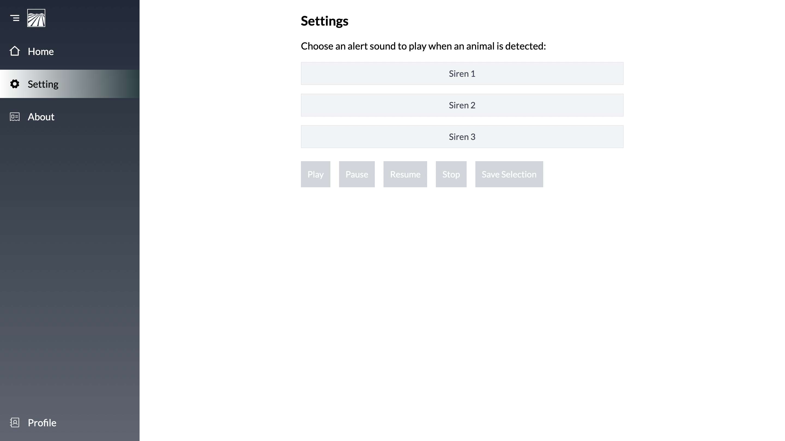

# **Animal-Intrusion-in-Farmland-Computer-Vision**

## **Previews**

---

## About the Project

This project aims to protect farmland from animal intrusions using a YOLO model for object detection. The system identifies animals that enter the farmland and provides alerts, including sound notifications, to alert farmers. The features include image, video, and webcam inputs for real-time animal detection.

This project is being developed with the collaboration of me and my professor, and we are working on a research paper exploring the use of computer vision techniques, specifically YOLO, to address this problem.

---

## Tech Stack

- **Frontend**: React.js
- **Backend**: Flask API
- **Computer Vision**: YOLO Model
- **Database**: MongoDB

---

## Features

- **For Farmers**:
  - **Real-time Animal Detection**: Detect animals entering farmland using webcam, image, or video input.
  - **Alert System**: Trigger sound alarms (sirens) based on detected animal presence.
  
- **For Research/Analysis**:
  - **Data Collection**: Collect and analyze animal detection data to improve detection accuracy and efficiency.
  - **Model Training**: YOLO-based object detection model trained on various animal classes to recognize and alert for specific animals.

---

## How the System Works

1. **Input Methods**:
   - Users can provide input through a webcam, uploaded images, or videos. The system processes these inputs for animal detection.
   
2. **Animal Detection**:
   - The YOLO model processes the input and identifies animals in the farmland.
   
3. **Alert System**:
   - When an animal is detected, the system triggers an alarm (like a siren) to alert the farmer of an intrusion.

4. **Backend Communication**:
   - The frontend communicates with the backend via Flask API, sending image/video data for processing and receiving detection results.

5. **Database**:
   - MongoDB is used to store user data and detection results for further analysis.

---

## The Story Behind the Project

This project began with the goal of helping farmers protect their crops from animal intrusions. We decided to leverage computer vision and machine learning techniques, specifically YOLO, to detect animals in real-time.

Working closely with my professor, we developed the system, integrating image/video processing, object detection, and alert systems. The project not only addresses a critical real-world problem but also contributes to ongoing research in the application of AI in agriculture.

---

## Future Enhancements

- **Expand Animal Detection**: Train the YOLO model to detect a broader range of animals.
- **Integration with Smart Devices**: Future versions could integrate with IoT devices on the farm for real-time monitoring and automatic actions based on animal detections.